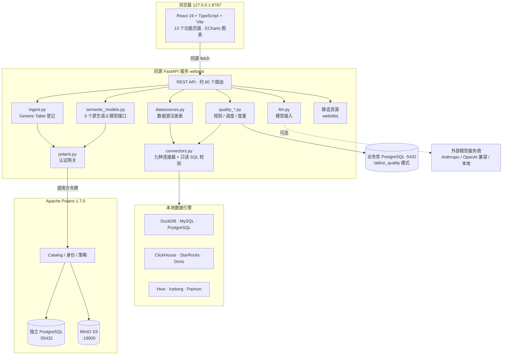

<!--
 Licensed to the Apache Software Foundation (ASF) under one
 or more contributor license agreements.  See the NOTICE file
 distributed with this work for additional information
 regarding copyright ownership.  The ASF licenses this file
 to you under the Apache License, Version 2.0 (the
 "License"); you may not use this file except in compliance
 with the License.  You may obtain a copy of the License at

  http://www.apache.org/licenses/LICENSE-2.0

 Unless required by applicable law or agreed to in writing,
 software distributed under the License is distributed on an
 "AS IS" BASIS, WITHOUT WARRANTIES OR CONDITIONS OF ANY
 KIND, either express or implied.  See the License for the
 specific language governing permissions and limitations
 under the License.
-->

# Lattice 数据平台

> 一个完全运行在本机回环地址上的中文数据平台：九种数据引擎、数据质量核查、智能问数、
> Apache Polaris 元数据目录与 Apache Ossie 语义模型，一条命令启动。

[](LICENSE)
[](scripts/pyproject.toml)
[](web/package.json)
[](integrations/polaris/README.md)

---

## 目录

- [项目简介](#项目简介)
- [核心功能能力](#核心功能能力)
- [架构与原理](#架构与原理)
- [页面功能展示](#页面功能展示)
- [安装、部署与启动](#安装部署与启动)
- [测试与验证](#测试与验证)
- [目录结构](#目录结构)
- [当前功能边界](#当前功能边界)
- [后期优化与迭代改进计划](#后期优化与迭代改进计划)
- [许可证与致谢](#许可证与致谢)

---

## 项目简介

**Lattice** 是构建在本仓库之上的数据平台层：一个同源的 FastAPI 服务、一套中文 WebUI、
本地引擎与服务的生命周期脚本，以及对 Apache Polaris 的真实集成。它把「数据源接入 →
元数据编目 → 数据质量 → 语义模型 → 查询与问数」这条链路收敛到一个本机可复现的环境里。

平台的全部组件只监听回环地址（`127.0.0.1`），不依赖任何云服务即可完整运行；所有凭据、
数据与日志都写在项目内的 `.runtime/` 目录下，删除该目录即可完全重建。

### Lattice 与 Apache Ossie 的关系

这是两个不同的东西，本文档中始终分开使用：

| | 指代 | 说明 |
| --- | --- | --- |
| **Apache Ossie** | 语义模型**规范**本身 | 以及它的 JSON Schema、官方校验器与各家转换器。见 [`core-spec/`](core-spec/)、[`converters/`](converters/)、[`validation/`](validation/) |
| **Lattice** | 规范之上的**平台层** | WebUI、后端服务、启动脚本与本地集成。见 [`webapi/`](webapi/)、[`web/`](web/)、[`scripts/`](scripts/) |

Apache Ossie 保留它原有的名字、命令与行为；Lattice 只是围绕它搭建的平台。上游项目地址：
[apache/ossie](https://github.com/apache/ossie)。仓库根目录的 `./lattice` 仅仅是一个启动器，
它派发到的全部是 Apache Ossie 自己的校验器和转换器，子命令名、参数和行为都没有改变。

---

## 核心功能能力

### 1. 多引擎数据源接入

WebUI 支持九种数据源类型，每一种都可以新增连接、测试连通性、浏览库表字段、预览数据并执行只读 SQL：

| 类型 | 分类 | 驱动 | 默认端口 |
| --- | --- | --- | --- |
| DuckDB | 本地文件 | `duckdb` | — |
| MySQL | 关系数据库 | PyMySQL | 3306 |
| PostgreSQL | 关系数据库 | psycopg 3 | 5432 |
| ClickHouse | OLAP 引擎 | clickhouse-connect | 8123 |
| StarRocks | OLAP 引擎 | PyMySQL（MySQL 协议） | 9030 |
| Apache Doris | OLAP 引擎 | PyMySQL（MySQL 协议） | 9030 |
| Apache Hive | 数据湖 / 数仓 | PyHive（Thrift + pure-sasl） | 10000 |
| Apache Iceberg | 数据湖表格式 | pyiceberg + DuckDB | — |
| Apache Paimon | 数据湖表格式 | pypaimon + DuckDB | — |

项目同时提供九个**开箱即用的本地实例**，写入同样的六张示例表
（`t_lattice_orders`、`t_lattice_order_items`、`t_lattice_customers`、`t_lattice_products`、
`t_lattice_sellers`、`t_lattice_payments`，`lattice_demo` 库，共 3390 行），
因此同一条 SQL 在九个数据源上返回一致的结果，可用来直接比较各引擎的行为差异。

机密只保存在本机，接口一律返回掩码；内置数据源由本机运行的引擎自动登记，每次启动重新生成。

### 2. 数据质量

参考 [Apache DataVines](https://github.com/datavane/datavines) 的度量模型实现：
每条规则生成一条「不合规行」查询和一条计数查询，把实际值与期望值按**结果公式、比较符和阈值**
比较得出成功或失败，并按下式计分：

```
得分 = (核查数 - 不合规数) / 核查数 × 100
```

六类核查规则：

| 核查规则类型 | 度量 | 不合规的含义 |
| --- | --- | --- |
| 唯一性校验 | 重复值检查 | 该字段出现多次的取值个数 |
| 完整性校验 | 空值检查、空字符串检查 | 字段为 NULL 或为空串的行数 |
| 准确性校验 | 正则匹配、字段长度、区间检查 | 不满足格式、长度或取值区间的行数 |
| 数据标准校验 | 枚举值检查 | 不在允许枚举内的行数 |
| 关联性校验 | 关联存在性检查 | 在关联表中找不到对应主键的行数 |
| 及时性校验 | 数据新鲜度检查 | 时间字段早于「当前时间 − 间隔」的行数 |

- **元数据存储**：规则、调度、执行日志与核查结果保存在 PostgreSQL 的 `lattice_quality` 模式中，
  表结构对应 DataVines 的 `dv_rule`、`dv_job_schedule`、`dv_job_execution`、`dv_job_execution_result`。
  该模式在服务启动时自动创建，**只新增对象，不读取也不修改库中原有的业务表**。
- **调度**：由服务内的后台线程驱动，支持 Quartz 六位 cron（秒在最前，如 `0 0 12 * * ?`）
  与五位 Unix cron。错过的触发不补跑，同一任务不并发触发；cron 无效的任务会被停止并记录原因，
  不影响其他任务。
- **安全**：所有核查 SQL 都经过与 SQL 工作台相同的只读校验，标识符按方言引用，
  正则、枚举、数值等字面量单独校验后才拼入 SQL；含分号、控制字符或子查询的输入会被拒绝。
  错误数据只做只读抽样展示，**不写回任何数据源**。

### 3. 智能问数

面向任一已注册数据源提问，输出图表与数据表，并保留查询历史。

- **未配置模型**时使用内置规则：规则以 DuckDB SQL 写一次，按所选引擎的方言转换后执行，
  因此九个本地引擎都能回答内置问题，页面明确标注「本地规则」。
- **配置模型后**由模型读取该数据源的真实表结构并生成 SQL。模型未必严格遵守目标方言，
  因此引擎拒绝执行时会按目标方言转换后自动重试一次，并在思考过程中说明，转换后的 SQL 同样展示给用户。

支持的模型服务商（在「智能问数 → 模型设置」中用下拉列表选择，无需手工拼参数）：

| 服务商 | 协议 | 说明 |
| --- | --- | --- |
| Anthropic 官方 API | Anthropic | 需要 API Key |
| OpenAI 官方 / 兼容接口 | OpenAI | 需要 API Key 与接口地址 |
| DeepSeek、阿里云百炼（通义千问）、月之暗面 Kimi、智谱 AI（GLM） | OpenAI 兼容 | 已预置官方接口地址，填 API Key 即可 |
| Ollama 本地模型、vLLM / 本地兼容服务 | OpenAI 兼容 | 本机服务，无需 API Key |
| 不使用模型 | — | 回到内置规则 |

「读取服务商模型列表」会调用服务商自己的模型列表接口，把账号下真实可用的模型并入下拉列表；
「测试连接」会真实调用一次模型并显示延迟与返回内容。**API Key 只保存在本机，接口一律返回掩码，
任何错误信息都不会回显密钥。** 访问外网服务商时遵循环境中的 `HTTPS_PROXY` / `NO_PROXY`。

### 4. Apache Polaris 集成

- 运行固定版本的官方 **Apache Polaris 1.7.0**（commit `4ac2f059d1cce149453d0a5f1ff1dff980ec97cc`），
  配套独立的 PostgreSQL 集群与 MinIO 对象存储。
- **API 控制台**解析固定版本的完整源规范，展示全部 **78 个接口**的参数、请求体及响应，
  覆盖 Catalog、身份、角色、授权、Iceberg 表与视图、事务、通用表、策略及映射、通知、认证和存储凭据。
- Polaris 1.7.0 自身实现其中 73 个。其余 **5 个原生语义模型接口**
  （`createSemanticModel`、`listSemanticModels`、`loadSemanticModel`、`updateSemanticModel`、`dropSemanticModel`）
  在上游仍是返回 HTTP 501 的占位实现，本项目按官方 OpenAPI 定义在同源的 Lattice 网关中实现了它们：
  请求/响应体与错误码与源规范一致；命名空间必须真实存在，否则 404；文档按仓库内的 Apache Ossie
  JSON Schema 校验，未通过返回 400；更新使用 `entity-version` 乐观并发，版本不匹配返回 409。
- 这些路径上的每一次上游调用都使用**调用方自己的令牌**，权限由 Polaris 按该主体判断，
  网关不会用自己的 root 身份替调用方放行。

### 5. 数据接入（Generic Table 登记）

把任意数据源中的表登记为 Polaris **Generic Table**，使其在 Catalog 中可被统一发现
（数据仍由原引擎存储），并记录来源数据源、Schema、表名与字段定义（`lattice.*` 属性）。
已登记的表可直接跳转到 SQL 工作台，针对其**原始引擎**执行查询，也可随时取消登记。

### 6. SQL 工作台与语义模型

- **SQL 工作台**：对选定数据源执行只读 `SELECT` / `WITH`，限制外部访问、查询时间与返回行数，
  截断时显示提示。
- **语义模型**：使用仓库现有的 Apache Ossie 校验器检查 YAML；既可调用 Polaris 原生语义模型接口
  发布、加载、更新和删除模型，也可将 YAML 保存为 Lattice 扩展的独立版本存档。

---

## 架构与原理

### 整体架构



### 请求链路

1. 浏览器加载 `web/dist` 的静态资源，全部 API 调用都是**同源**请求，不存在跨域配置。
2. 后端按 `source_id` 从数据源注册表取出记录，交给对应连接器；连接器负责方言引用、
   只读校验、超时与行数限制。
3. 涉及 Polaris 的操作统一经过 `polaris.py` 网关；语义模型路径透传调用方令牌，
   由 Polaris 判定权限。
4. 质量规则在真实数据源上只读执行，结果写入业务库的 `lattice_quality` 模式。

### 关键设计原理

| 设计 | 原理与收益 |
| --- | --- |
| **单一同源入口** | 一个 FastAPI 进程同时提供 UI 静态资源与全部 API，浏览器无需跨域，网关不把 root 密钥下发前端 |
| **连接器抽象** | 九种引擎统一为 `Connector` 接口（连接、探测、列表、预览、查询、方言引用），新增引擎只需实现一个类 |
| **只读 SQL 校验** | 所有用户与模型产生的 SQL 都经同一套校验：仅允许 `SELECT` / `WITH`，拒绝分号、控制字符与危险构造，字面量单独校验后拼接 |
| **方言转换** | 以 `sqlglot` 在 DuckDB 方言与目标引擎方言之间转换，使一套内置规则适配九个引擎 |
| **运行时隔离** | 所有状态写入 `.runtime/`（引擎数据、Polaris、凭据、日志、Python 环境），已加入 `.gitignore`，删除即可完全重建 |
| **凭据处理** | 私有配置以 `0600` 原子写入，接口一律返回掩码，错误信息不回显密钥 |
| **进程所有权** | 启动脚本以 PID + `ps` 身份 + 所属目录三重校验进程归属，**从不终止不是自己启动的进程** |
| **构建版本检查** | `/api/health` 返回构建摘要，页面比对自身加载时的版本，重新构建后会提示刷新，避免长开标签页一直运行旧代码 |

### 技术栈

| 层 | 技术 |
| --- | --- |
| 前端 | React 19、TypeScript 5.7、Vite 6、ECharts 6、lucide-react |
| 后端 | Python 3.12、FastAPI、uvicorn、sqlglot、duckdb、psycopg 3、pyiceberg、pypaimon |
| 元数据 | Apache Polaris 1.7.0、PostgreSQL、MinIO |
| 工具链 | uv（固定摘要下载）、pytest、prettier |

---

## 页面功能展示

WebUI 采用左侧导航 + 多标签工作区，共 13 个页面：

| 页面 | 主要能力 |
| --- | --- |
| **指标总览** | 平台整体指标与示例数据图表入口 |
| **数据地图** | 浏览已注册数据源的库、表、字段与数据量 |
| **数据源** | 卡片式列表；新增、编辑、测试、删除九种类型连接；「环境预设」可套用本机已有数据源参数；内置数据源可隐藏并一键恢复 |
| **数据接入** | 把外部表登记为 Polaris Generic Table；已登记的表可直接跳转 SQL 工作台查询原始引擎，或取消登记 |
| **数据质量** | 五个页签：核查规则、调度任务、质量报告、统计分析、执行日志 |
| **标准规范** | 查看仓库内现有的 Apache Ossie 规范与模型校验结果 |
| **语义模型** | Apache Ossie YAML 校验；通过 Polaris 原生接口发布 / 加载 / 更新 / 删除，或存为独立版本存档 |
| **SQL 工作台** | 对选定数据源执行只读 SQL，显示实际结果、耗时与截断提示 |
| **数据服务** | 数据服务相关视图 |
| **智能问数** | 自然语言提问，展示思考过程、生成的 SQL、图表与历史；支持模型设置与连接测试 |
| **Catalog 管理** | 展示真实 Polaris Catalog 元数据，可进入管理 API 执行变更 |
| **身份与权限** | Polaris 主体、角色与授权 |
| **API 控制台** | 全部 78 个接口的参数、请求体与响应；标注哪些由 Polaris 原生实现、哪些由 Lattice 网关实现 |

> 页面截图尚未收录到仓库中。可在本机启动后访问 <http://127.0.0.1:8787> 查看实际效果。

---

## 安装、部署与启动

### 前置依赖

需要预先安装：

- **Go**（支持自动下载工具链）
- **JDK 21+** 与 **Maven**
- **Node.js / npm**
- **PostgreSQL 15+** 的命令行程序（本机使用 PostgreSQL 16；脚本会查找 Homebrew 等常见位置，
  其他目录可设 `LATTICE_PG_BIN`）
- **curl、OpenSSL、lsof、ps**
- **Docker**（仅 StarRocks、Doris、Hive 需要；缺少时这三个引擎保持离线，其余功能不受影响）

uv 0.9.30、Python 3.12、官方 Polaris 与 MinIO 由脚本自动准备，下载的运行时会校验固定摘要。
**脚本不会使用 sudo，也不会修改 shell 配置。**

### 一键启动

```bash
git clone https://github.com/Mdz-Bigdata/lattice.git
cd lattice
./start.sh
```

macOS 也可在 Finder 中双击根目录的 `start.command`。

默认执行完整测试：检查 Python 核心包、全部 Python 转换器、校验器、Go CLI、Java 转换器、
Web API 和运行时管理逻辑，最后启动网页及依赖服务。必要步骤失败会返回非零退出码并保留日志。
**首次运行需要网络下载工具和依赖。**

需要快速重新准备时：

```bash
./start.sh --quick     # 跳过完整测试，仍执行构建、基本运行检查和 WebUI 启动
```

### 日常启动、状态与停止

```bash
./start-web.sh            # 启动 WebUI 与全部本地示例引擎
./start-web.sh status     # 查看状态
./start-web.sh restart    # 重启
./start-web.sh stop       # 停止本项目的服务，保留数据
./start-web.sh engines    # 只启动本地示例引擎
```

macOS 日常使用可双击 `start-web.command`。重复 `start` 会检查并复用已就绪的实例；
端口冲突会明确失败。指定其他端口：`LATTICE_WEB_PORT=8788 ./start-web.sh`。

启动后访问 **<http://127.0.0.1:8787>**。

### 服务与端口

| 服务 | 本机地址 | 数据 / 日志 |
| --- | --- | --- |
| WebUI / API | `127.0.0.1:8787` | `.runtime/webui/`（`server.log`、`startup.log`） |
| Polaris | `127.0.0.1:8181` | `.runtime/polaris/` |
| Polaris 健康检查 | `127.0.0.1:8182/q/health` | readiness / liveness |
| 独立 PostgreSQL | `127.0.0.1:55432` | `.runtime/polaris/postgres/` |
| MinIO S3 | `127.0.0.1:19000` | `.runtime/polaris/object-store/` |
| PostgreSQL（业务库） | `127.0.0.1:5432/blog_converter` | 质量元数据在 `lattice_quality` 模式 |
| MySQL | `127.0.0.1:33306` | `.runtime/engines/mysql/` |
| ClickHouse | `127.0.0.1:18123`（HTTP）/ `19009` | `.runtime/engines/clickhouse/` |
| StarRocks | `127.0.0.1:19030`（MySQL 协议）/ `18030` | Docker 卷 `lattice-starrocks-*` |
| Apache Doris | `127.0.0.1:29030`（MySQL 协议）/ `28030` | Docker 卷 `lattice-doris-*` |
| Apache Hive | `127.0.0.1:20000`（HiveServer2）/ `20002` | 容器 `lattice-hive` |
| Paimon 仓库 | 本地文件 | `.runtime/engines/paimon/warehouse/` |

Polaris 服务凭据位于 `.runtime/polaris/credentials.json`，MinIO 凭据位于 `local-s3.json`，权限均为 `600`。

### 环境变量

平台的环境变量一律使用 `LATTICE_` 前缀：

| 变量 | 作用 |
| --- | --- |
| `LATTICE_WEB_PORT` | WebUI / API 端口，默认 8787 |
| `LATTICE_QUALITY_DSN` | 数据质量元数据库连接串 |
| `LATTICE_LLM_PROVIDER`、`LATTICE_LLM_MODEL`、`LATTICE_LLM_API_KEY`、`LATTICE_LLM_BASE_URL` | 智能问数的默认模型配置 |
| `LATTICE_PG_BIN` | PostgreSQL 命令行程序所在目录 |
| `LATTICE_MYSQLD` | 本地示例 MySQL 的 `mysqld` 路径 |
| `LATTICE_ENGINE_PULL` | 设为 `0` 时不下载容器镜像；StarRocks、Doris、Hive 将保持离线 |

### 备份与重建

所有状态都在 `.runtime/` 下。备份时先停止服务，再备份整个 `.runtime/polaris/` 与 `.runtime/webui/`；
删除 `.runtime/` 后重新运行 `./start.sh` 即可从零重建。

---

## 测试与验证

```bash
# 平台自动化测试（当前 660 项）
.runtime/envs/core/bin/python -m pytest scripts/tests webapi/tests -q

# 前端类型检查与构建
cd web && npm run build

# 真实接口验证（需先启动服务）
.runtime/envs/core/bin/python scripts/verify-webui.py
```

`verify-webui.py` 使用唯一名称创建临时目录、身份、表、视图和策略，执行后清理，
报告写入 `.runtime/webui/verification.json`。报告**区分成功操作、预期的权限拒绝及上游未实现的 501**，
不将返回错误的接口记作功能成功；它还会临时创建一个只读主体，验证网关确实按调用方权限放行。

最近一次启动日志位于 `.runtime/logs/latest.log`，失败后先查看该文件。

---

## 目录结构

```
.
├── webapi/               # FastAPI 后端：数据源、连接器、质量、接入、语义模型、Polaris 网关
│   └── tests/            # 后端测试
├── web/                  # React + TypeScript WebUI
│   └── src/              # 13 个功能页面与共用组件
├── scripts/              # 启动与运行时管理：本地引擎、WebUI 服务、验证脚本
│   └── tests/            # 脚本测试
├── integrations/
│   ├── polaris/          # 固定版本 Polaris 服务与解析后的 API 规范
│   └── engines/          # 引擎镜像与二进制的固定版本信息
├── core-spec/            # Apache Ossie 规范、JSON Schema 与文档
├── converters/           # Apache Ossie 官方转换器（dbt、GoodData、Polaris、Salesforce 等）
├── validation/           # Apache Ossie 校验工具
├── examples/             # 示例语义模型
├── docs/local-start.md   # 更详细的本地启动与功能说明
├── tasks/                # 项目计划与进度记录
├── start.sh              # 一键准备与启动
├── start-web.sh          # 日常启动 / 停止 / 状态
└── lattice               # Apache Ossie 校验器与转换器的启动器
```

---

## 当前功能边界

为避免误解，以下内容**尚未实现或依赖外部条件**：

- Apache Ossie **Go CLI** 的 `convert`、`validate`、`plugin install`、`plugin remove`
  仍是仓库中的占位实现。根目录的 `lattice` 直接调用已有的 Python 和 Java 工具；
  `cli/dist/ossie` 是另一个程序，它构建和测试通过**不代表**这些占位命令已实现。
- **Trino、Genie** 不在本仓库中。
- **Catalog federation、OIDC、OPA / Ranger、事件基础设施、云对象存储**需要对应的服务与凭据。
- **Salesforce → Apache Ossie** 导入所需 schema 会在首次运行时从 Salesforce 官方文档下载并校验。
- **Iceberg 与 Paimon** 通过 DuckDB 读取，单表最多扫描 50 万行，页面会标注统计可能不完整。
- 质量模块目前**可调度的只有内置的 `QualityTask.run`**。
- 测试验证的是本机环境与仓库覆盖的场景；具体输入能否转换，仍由对应转换器的支持范围决定。

---

## 后期优化与迭代改进计划

> 以下为**规划中**的方向，尚未实现。

### 近期（工程化与易用性）

- [ ] **容器化交付**：提供 `docker compose` 一键拉起全套依赖，降低对本机 Go / JDK / Maven / PostgreSQL 的要求
- [ ] **CI 流水线**：为 `webapi`、`web`、`scripts` 建立独立的 GitHub Actions 工作流，替代继承自上游的转换器 CI
- [ ] **页面截图与演示**：补齐 README 的界面截图与一段端到端演示录屏
- [ ] **前端测试**：引入组件与端到端测试，目前前端仅有类型检查与构建校验
- [ ] **English README**：面向非中文使用者提供英文文档

### 中期（能力增强）

- [ ] **多用户与鉴权**：目前平台假定单人本机使用，需要登录态、会话与基于角色的页面权限
- [ ] **通用任务调度**：把调度器从仅支持 `QualityTask.run` 扩展为可注册任意任务，并补齐失败重试与补跑策略
- [ ] **质量规则增强**：自定义 SQL 规则、跨库比对、规则模板与批量下发
- [ ] **数据血缘**：基于 SQL 解析与 Polaris 元数据构建表级 / 字段级血缘视图
- [ ] **更多数据源**：Oracle、SQL Server、MongoDB、Elasticsearch、Kafka
- [ ] **查询结果缓存**：对重复问数与报表查询增加带失效策略的缓存层

### 长期（平台化）

- [ ] **语义层查询引擎**：让语义模型可直接被查询，而不只是被校验与存储
- [ ] **指标平台**：以 Apache Ossie 语义模型为唯一口径，统一指标定义、计算与消费
- [ ] **AI 增强**：模型辅助生成质量规则与语义模型，以及基于血缘的根因分析
- [ ] **可观测性**：结构化日志、指标与链路追踪，以及面向运维的健康视图
- [ ] **跟进 Apache Ossie 上游**：持续同步规范演进，并在上游实现原生语义模型接口后
      切换回官方实现（见 [ROADMAP.md](ROADMAP.md)）

欢迎通过 [Issues](https://github.com/Mdz-Bigdata/lattice/issues) 提出需求与问题。

---

## 许可证与致谢

本项目基于 **[Apache License 2.0](LICENSE)** 开源，派生自
[apache/ossie](https://github.com/apache/ossie)（Apache Ossie，incubating），
完整保留上游的 `LICENSE`、`NOTICE` 与 `DISCLAIMER`。

致谢以下上游项目：

- **[Apache Ossie](https://github.com/apache/ossie)** — 语义模型规范、JSON Schema、校验器与转换器
- **[Apache Polaris](https://polaris.apache.org/)** — 元数据目录服务
- **[Apache DataVines](https://github.com/datavane/datavines)** — 数据质量度量模型的设计参考
- **Apache Iceberg、Apache Paimon、Apache Doris、Apache Hive、StarRocks、ClickHouse、DuckDB、PostgreSQL、MySQL**

> Apache、Apache Ossie、Apache Polaris 及相关标识是 Apache 软件基金会的商标。
> 本仓库是个人对上游项目的派生与扩展，**不隶属于 Apache 软件基金会，也不代表其立场**。

更详细的本地启动与功能说明见 [docs/local-start.md](docs/local-start.md)；
Polaris 集成细节见 [integrations/polaris/README.md](integrations/polaris/README.md)。
